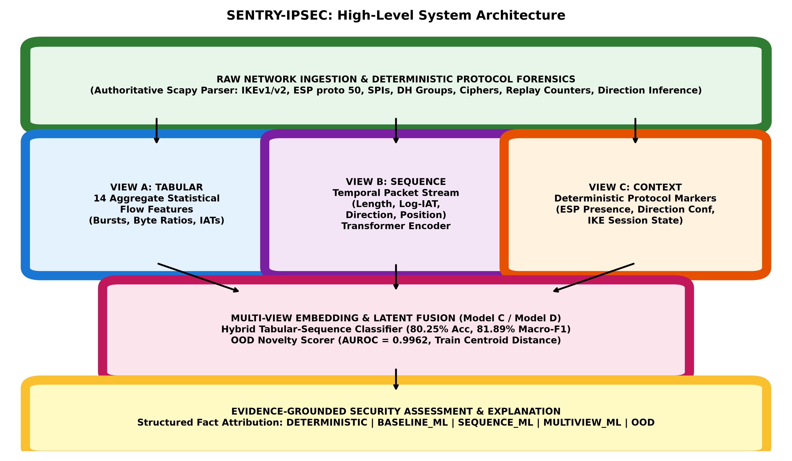

# 01. IPsecTrace — Executive Research Overview

## 1. Executive Summary

**IPsecTrace** is an integrated security analysis and traffic inference architecture designed specifically for encrypted **IPsec (IKE/ESP/AH)** tunnels. Traditional network intrusion detection systems (NIDS) and deep packet inspection (DPI) engines fail against IPsec because the Encapsulating Security Payload (ESP) encrypts Layer 4 transport headers and user payloads.

IPsecTrace resolves this challenge by combining:
1. **Deterministic Protocol Forensics**: Authoritative extraction of IKEv1/v2 negotiation parameters, cryptographic transform suites, Diffie-Hellman groups, Perfect Forward Secrecy (PFS) states, Security Parameter Indexes (SPIs), sequence counters, and packet-level directionality.
2. **Encrypted-Side Temporal Sequence Learning**: Lightweight Transformer self-attention encoders capturing raw packet lengths, log inter-arrival times, directions, and burst positions without decrypting ESP ciphertext.
3. **Hybrid Multi-View Fusion**: Fusing aggregate flow statistics (14 tabular features) with temporal sequence dynamics, achieving **80.25% mean accuracy** and **81.89% Macro-F1** (a **+13.35 percentage-point improvement** over canonical XGBoost).
4. **Uncertainty & Open-Set Novelty Detection**: Distance-to-centroid novelty estimation in latent embedding space (AUROC = 0.9962) identifying out-of-distribution traffic anomalies.
5. **Evidence-Grounded Attribution**: Structured explanation generation enforcing strict attribution (`DETERMINISTIC`, `BASELINE_ML`, `SEQUENCE_ML`, `MULTIVIEW_ML`, `OOD`).

---

## 2. Core Research Question & Hypothesis

> **"Can protocol-aware, multi-view AI combine deterministic IPsec control-plane evidence with encrypted-side temporal behavior to provide more accurate, uncertainty-aware, explainable traffic inference without decrypting ESP payloads?"**

- **Hypothesis**: Aggregate statistical flow summaries discard packet order, request-response timing, and burst dynamics necessary to differentiate low-throughput web polling from interactive shell keystrokes. A hybrid representation will resolve this boundary while deterministic parsers protect cryptographic truth.

---

## 3. High-Level Architecture

The architecture strictly decouples **authoritative cryptographic facts** from **probabilistic behavioral inferences**:
- **Deterministic Engine**: Authoritative for security compliance, cipher deprecation, weak DH groups, and replay protection.
- **Machine Learning Engine**: Provides advisory traffic classification (`BULK`, `ICMP`, `INTERACTIVE`, `WEB`) and confidence margins.
- **Evidence Fusion**: Merges deterministic facts with ML uncertainty states, ensuring ML never alters cryptographic findings.

---

## 4. Key Benchmark Results (5-Fold GroupKFold)

| Model Configuration | Accuracy (Mean ± Std) | Macro-F1 (Mean ± Std) | Weighted-F1 (Mean ± Std) | Delta Acc vs Baseline |
| :--- | :---: | :---: | :---: | :---: |
| **Model A: Canonical XGBoost Baseline** | 66.91% ± 18.66% | 73.91% ± 4.84% | 68.22% ± 18.65% | +0.00% |
| **Model B1: Sequence Transformer** | 69.96% ± 26.40% | 77.66% ± 14.59% | 68.29% ± 30.87% | +3.05% |
| **Model B2: Protocol-Aware Sequence** | 67.23% ± 22.06% | 70.95% ± 10.62% | 64.75% ± 26.99% | +0.32% |
| **Model B3: SSL Pretrained Sequence** | 72.25% ± 25.73% | 76.18% ± 13.33% | 68.51% ± 30.06% | +5.35% |
| **Model C: Hybrid Tabular + Sequence** | **80.25% ± 13.77%** | **81.89% ± 9.15%** | **81.56% ± 12.48%** | **+13.35%** |
| **Model D: Multi-View IPsec** | 61.33% ± 25.07% | 70.28% ± 9.54% | 58.13% ± 30.02% | -5.58% |

---

## 5. Main Scientific Takeaways

1. **Hybrid Representation is Optimal**: Fusing tabular aggregate flow statistics with Transformer sequence embeddings raises `INTERACTIVE` F1-score from **38.46% to 63.46%**, proving that temporal dynamics resolve the web vs interactive ambiguity.
2. **Self-Supervised Pretraining Provides Inductive Regularization**: Masked packet feature reconstruction pretraining (Model B3) delivered a **+5.35%** accuracy gain over baseline without requiring labeled data.
3. **Negative Multi-View Result Documented**: In a homogeneous native-IPsec testbed, static Layer 3/4 context markers (`is_esp=1`) lack discriminative entropy; over-parameterizing the context view diluted gradient flow (Model D: 61.33%).
4. **Deterministic Authority Preserved**: AI models are restricted to behavioral evidence; cryptographic parameters remain 100% deterministic and authoritative.
