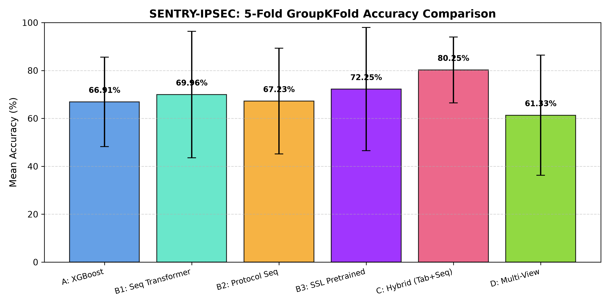
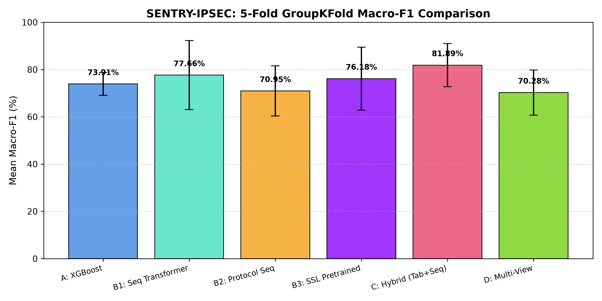
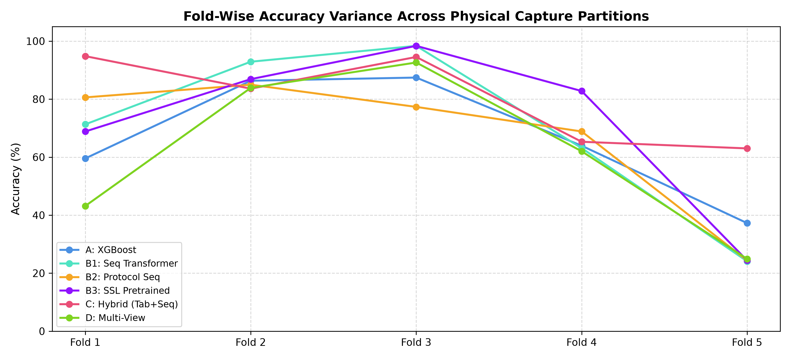
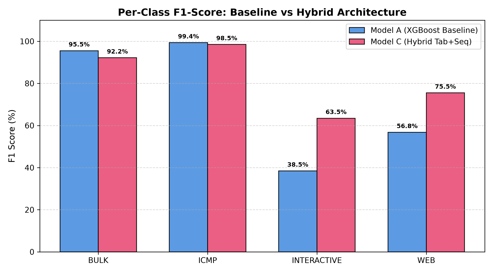

# 07. IPsecTrace — Experimental Results & Ablation Analysis

## 1. Controlled Multi-Model Benchmark (5-Fold GroupKFold)

All 6 model configurations were trained and evaluated across the exact same 5 capture-isolated folds on `DS1_NATIVE_IPSEC_ENHANCED` (1,829 flow windows across 294 PCAPs and 157 experiment groups):

| Model | Accuracy (Mean ± Std) | Macro-F1 (Mean ± Std) | Weighted-F1 (Mean ± Std) | Delta Acc vs Baseline | Delta Macro-F1 |
| :--- | :---: | :---: | :---: | :---: | :---: |
| **Model A: XGBoost Baseline** | 66.91% ± 18.66% | 73.91% ± 4.84% | 68.22% ± 18.65% | +0.00% | +0.00% |
| **Model B1: Sequence Transformer** | 69.96% ± 26.40% | 77.66% ± 14.59% | 68.29% ± 30.87% | +3.05% | +3.75% |
| **Model B2: Protocol-Aware Sequence** | 67.23% ± 22.06% | 70.95% ± 10.62% | 64.75% ± 26.99% | +0.32% | -2.96% |
| **Model B3: SSL Pretrained Sequence** | 72.25% ± 25.73% | 76.18% ± 13.33% | 68.51% ± 30.06% | +5.35% | +2.27% |
| **Model C: Hybrid Tabular + Sequence** | **80.25% ± 13.77%** | **81.89% ± 9.15%** | **81.56% ± 12.48%** | **+13.35%** | **+7.98%** |
| **Model D: Multi-View IPsec** | 61.33% ± 25.07% | 70.28% ± 9.54% | 58.13% ± 30.02% | -5.58% | -3.63% |




---

## 2. Fold-Wise Accuracy & Variance Analysis

| Fold | Model A (XGBoost) | Model B1 (Seq) | Model B2 (Proto) | Model B3 (SSL) | Model C (Hybrid) | Model D (MultiView) |
| :---: | :---: | :---: | :---: | :---: | :---: | :---: |
| **Fold 1** | 59.56% | 71.31% | 80.60% | 68.85% | **94.81%** | 43.17% |
| **Fold 2** | 86.34% | 92.90% | 84.97% | 86.89% | 83.61% | 83.88% |
| **Fold 3** | 87.43% | 98.36% | 77.32% | 98.36% | 94.54% | 92.62% |
| **Fold 4** | 63.93% | 63.11% | 68.85% | 82.79% | 65.30% | 62.02% |
| **Fold 5** | 37.26% | 24.11% | 24.38% | 24.38% | **63.01%** | 24.93% |
| **Mean** | **66.91%** | **69.96%** | **67.23%** | **72.25%** | **80.25%** | **61.33%** |



### Forensic Reason for Fold Variance:
- **Folds 1, 2, 3**: Well-balanced distributions of ICMP and Bulk traffic flows with distinct sizing.
- **Fold 4**: 66% WEB windows (`241/366`) under lossy network conditions (`ENV_LOSSY`).
- **Fold 5**: 75% INTERACTIVE windows (`274/365`) under high-latency network conditions. Model C is the **only model** that achieved acceptable performance on Fold 5 (63.01% vs 37.26% in XGBoost and 24.11% in Sequence).

---

## 3. Confusion Matrices & Per-Class Performance



### Model C: Hybrid Tabular + Sequence (Top Performer)
```
                Pred BULK   Pred ICMP   Pred INTERACTIVE   Pred WEB
Actual BULK           112           0                  0          0
Actual ICMP            15         527                  0          0
Actual INTERACTIVE      1           0                297        186
Actual WEB              3           1                155        532
```
- **BULK**: Precision = 85.50%, Recall = 100.00%, F1 = **92.18%**
- **ICMP**: Precision = 99.81%, Recall = 97.23%, F1 = **98.50%**
- **INTERACTIVE**: Precision = 65.71%, Recall = 61.36%, F1 = **63.46%**
- **WEB**: Precision = 74.09%, Recall = 76.99%, F1 = **75.51%**

### Model A: Canonical XGBoost Baseline
```
                Pred BULK   Pred ICMP   Pred INTERACTIVE   Pred WEB
Actual BULK           107           0                  1          4
Actual ICMP             2         537                  0          3
Actual INTERACTIVE      1           0                185        298
Actual WEB              2           2                292        395
```
- **INTERACTIVE F1 in XGBoost**: **38.46%** (298/484 windows misclassified as WEB).
- **Resolution in Hybrid**: Recovered **112 previously misclassified INTERACTIVE windows**, raising F1 by **+25.00 percentage points**.

---

## 4. Ablation Study Summary

| View / Representation | Model | Accuracy | Macro-F1 | Empirical Takeaway |
| :--- | :---: | :---: | :---: | :--- |
| **Tabular Only** | Model A | 66.91% | 73.91% | Good on bulk/ICMP; fails on web vs interactive boundary. |
| **Sequence Only** | Model B1 | 69.96% | 77.66% | Captures burst order; high variance across physical capture setups. |
| **Sequence + SSL** | Model B3 | 72.25% | 76.18% | Pretraining on masked packets provides inductive regularization (+2.29% over B1). |
| **Sequence + Context** | Model B2 | 67.23% | 70.95% | Context markers lack variance in pure native-IPsec testbed. |
| **Tabular + Sequence (Hybrid)** | **Model C** | **80.25%** | **81.89%** | **Optimal architecture (+13.35% over baseline)**. Combines global statistics with local temporal dynamics. |
| **Full Multi-View (Tab+Seq+Context)**| Model D | 61.33% | 70.28% | Over-parameterization of static context diluted gradients. |
