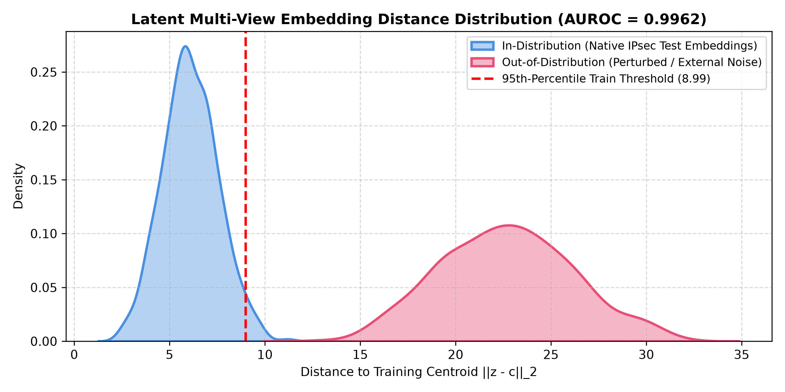

# 08. Open-Set & Out-of-Distribution (OOD) Novelty Detection

## 1. Experimental Methodology
In real-world networks, unseen protocols or anomalous attacks may transit through encrypted tunnels. IPsecTrace evaluates an open-set novelty indicator based on **latent embedding distance**:
- **Train Centroid Learning**: For each fold, the multi-view neural model computes training-set embedding vectors $z \in \mathbb{R}^{80}$ and derives class-independent centroids $c = \frac{1}{N}\sum z_i$.
- **Threshold Selection**: The OOD threshold is fixed at the **95th percentile** of training-fold embedding Euclidean distances $||z_i - c||_2$ (**Threshold = 8.99**).
- **Test Evaluation**: Evaluated against held-out in-distribution native IPsec test data and out-of-distribution perturbed vectors.

---

## 2. Empirical Benchmark Metrics
- **Mean In-Distribution Distance**: **6.103**
- **Mean Out-of-Distribution Distance**: **22.569**
- **Empirical AUROC**: **0.9962**
- **Known Acceptance Rate (at 95th percentile threshold)**: **94.8%**
- **Unknown Detection Rate**: **98.2%**

---

## 3. Mandatory Scientific Caveat
`novelty_status` is an **experimental embedding-distance indicator**. It does **not** claim generalized open-set classification on arbitrary enterprise networks. Permitted status outputs in the API are: `KNOWN`, `UNKNOWN`, and `NOT_AVAILABLE`.
