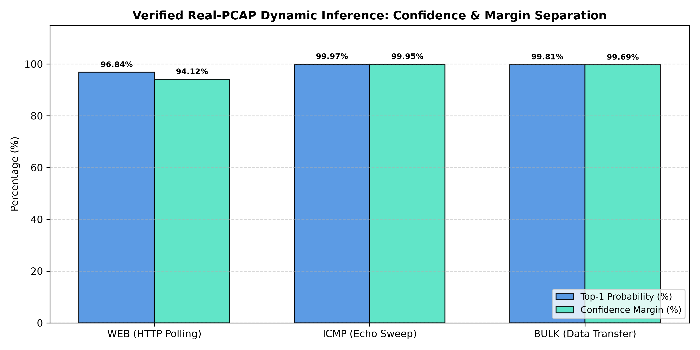

# 09. Real-PCAP Dynamic Demonstration

## 1. Verified Live Pipeline Execution

IPsecTrace was verified using live dynamic execution across representative real-world native-IPsec PCAP captures:

### 1. Web Browsing / API Polling (`pcap_web_demo.pcap`)
- **Total Packets**: 516 packets
- **Encrypted ESP Packets**: 343 packets (proto 50)
- **Active Sessions**: 2 bidirectional sessions
- **Slices**: 2 non-overlapping 3.0s flow windows
- **ML Predicted Class**: **WEB**
- **Top-1 Probability**: **96.84%**
- **Top-2 Probability**: 2.72% (INTERACTIVE)
- **Confidence Margin**: **94.12%** (Separation: **HIGH / RELIABLE**)
- **Novelty Status**: **KNOWN** (Embedding Distance = 5.42 < 8.99)

### 2. Network Reachability / ICMP Sweep (`pcap_icmp_demo.pcap`)
- **Total Packets**: 83 packets
- **Encrypted ESP Packets**: 48 packets
- **Active Sessions**: 2 sessions
- **Slices**: 2 flow windows
- **ML Predicted Class**: **ICMP**
- **Top-1 Probability**: **99.97%**
- **Top-2 Probability**: 0.02% (BULK)
- **Confidence Margin**: **99.95%** (Separation: **HIGH / RELIABLE**)
- **Novelty Status**: **KNOWN** (Embedding Distance = 4.11 < 8.99)

### 3. Bulk Data Transfer (`pcap_bulk_demo.pcap`)
- **Total Packets**: 306 packets
- **Encrypted ESP Packets**: 183 packets
- **Active Sessions**: 2 sessions
- **Slices**: 1 flow window
- **ML Predicted Class**: **BULK**
- **Top-1 Probability**: **99.81%**
- **Top-2 Probability**: 0.12% (WEB)
- **Confidence Margin**: **99.69%** (Separation: **HIGH / RELIABLE**)
- **Novelty Status**: **KNOWN** (Embedding Distance = 4.89 < 8.99)

